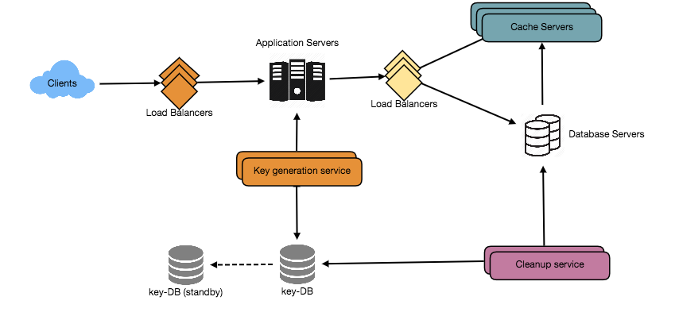

# Question 1
We can use caching for this purpose. We can cache URLs that are frequently accessed. We can use some off-the-shelf solution like Memcache, which can store full URLs with their respective hashes. The application servers, before hitting backend storage, can quickly check if the cache has the desired URL. 

When the cache is full, and we want to replace a link with a newer/hotter URL, how would we choose? Least Recently Used (LRU) can be a reasonable policy for our system. Under this policy, we discard the least recently used URL first. We can use a Linked Hash Map 44 or a similar data structure to store our URLs and Hashes, which will also keep track of which URLs are accessed recently.

# Question 2

We can have a separate server for handling the traffic from South Korea. We can place a server in South Korea(or nearby location) using AWS (or other cloud service provider) and routing the traffic from this region to the designated server will help improve the latency. The logic of routing the request to designated server has to be handled by the load balancer.

# Question 3

