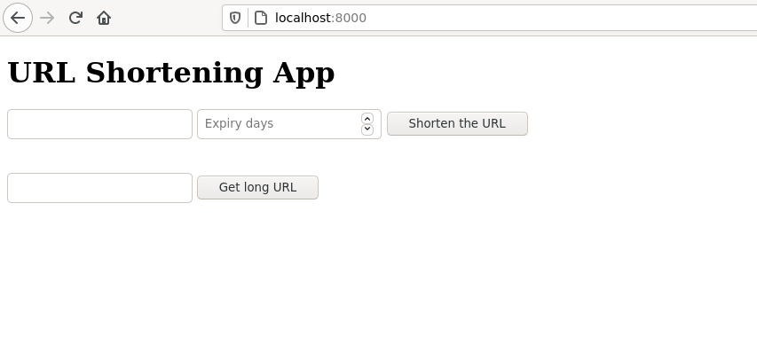
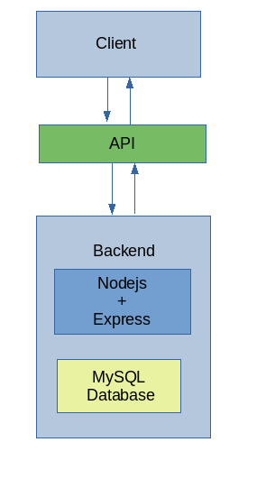
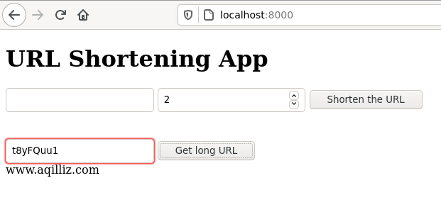

># Aqilliz Assignment

# Introduction 
## What does it do?

A URL shortener application take a full length URL and converts it into shortened URL. The web application developed for the purpose of this assignment can be accessed from UI.

## Screenshot of UI/UX:

## Technology stack:

> Server:

    Nodejs + Express
    MySQl

> Client:
    
    HTML
    Javascript
> Deployment:
    
    Docker

## API Specification:
 Two API endpoints are build:
 1. /register takes in a Long URl in a request parameter and returns a unique identifier.

    For example:
    > localhost:8000/register?url=www.example.com 

    returns a randomly generated identifier  Y0QQg0pn.

    The request parameter also excepts the expiry days parameter which determines after how many days the generated unique identifier is not accessible.

    For example:
    > localhost:8000/register?url=www.example.com&&epirydays=5

2. /retrieve takes the shortened unique identifier as a parameter and retrieves the long URL.
    For Example:
    > localhost:8000/retrieve?url=Y0QQg0pn
    
    returns the full URL www.example.com

## API Architecture

# Deployment Guide

The project can be deployed using Docker.

First build the docker image using dockerfile with following command:
> $ sudo docker build -t node-docker .

After that use docker-compose.yml to compose using following command:
> $ docker-compose up

The docker-compose.yml file contains environment values of the database. 

Once the node and mysql container have started, we should configure the  database and give all the necessary permission to allow access.

## Running schema.sql file 

Setup Database and Create table using schema.sql or following SQL commands:
> $ create database aqilliz_db;

> $ use aqilliz_db;

> $ create table url_map (tinyurl VARCHAR(8) primary key, longurl text, timerequested datetime, expirydate datetime);

# Preview

### Getting the shortened URL

### Getting the Full-length URL

